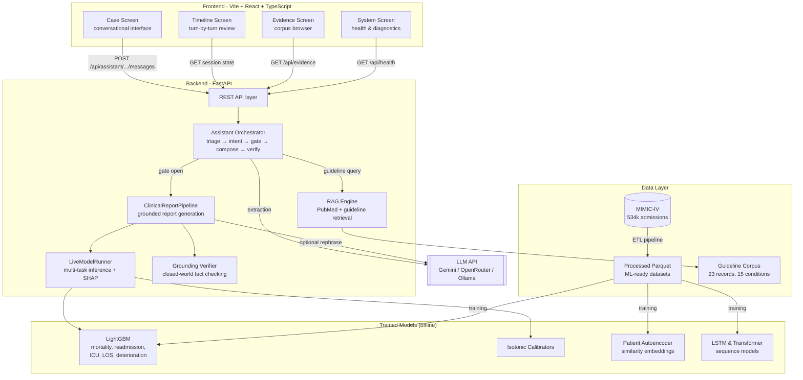
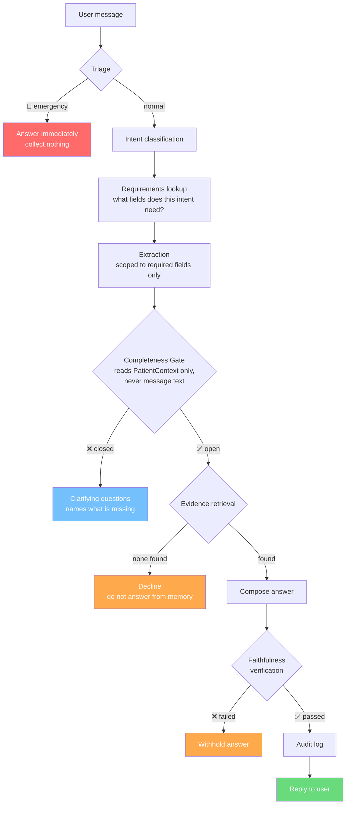
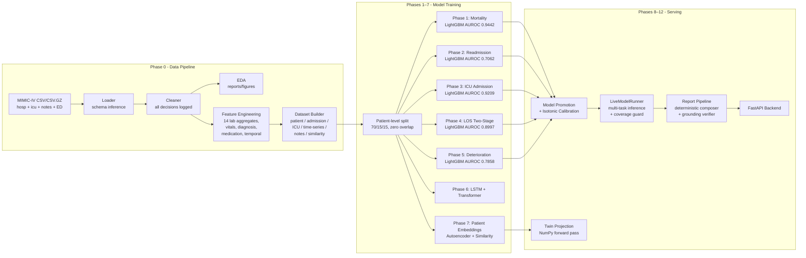
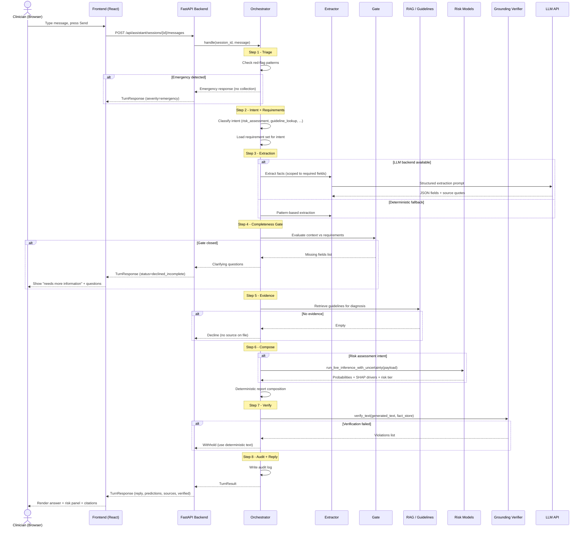
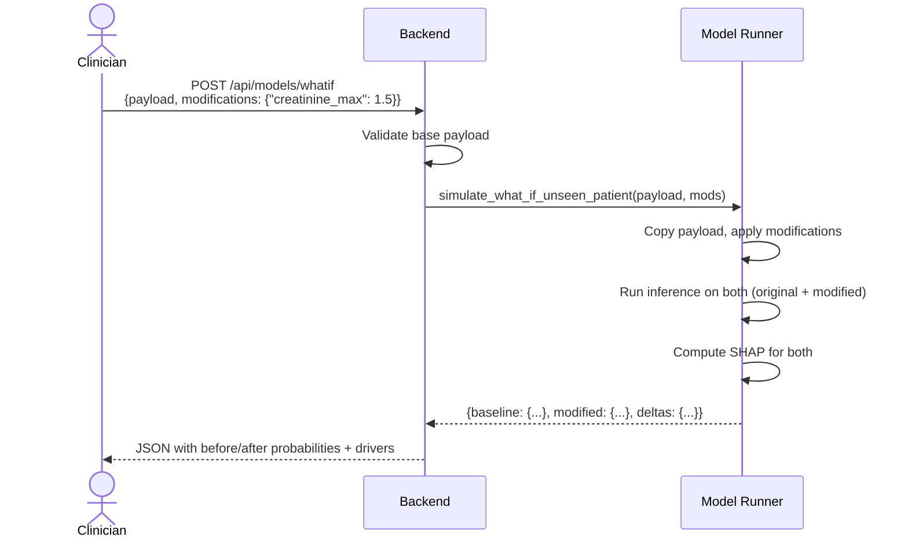
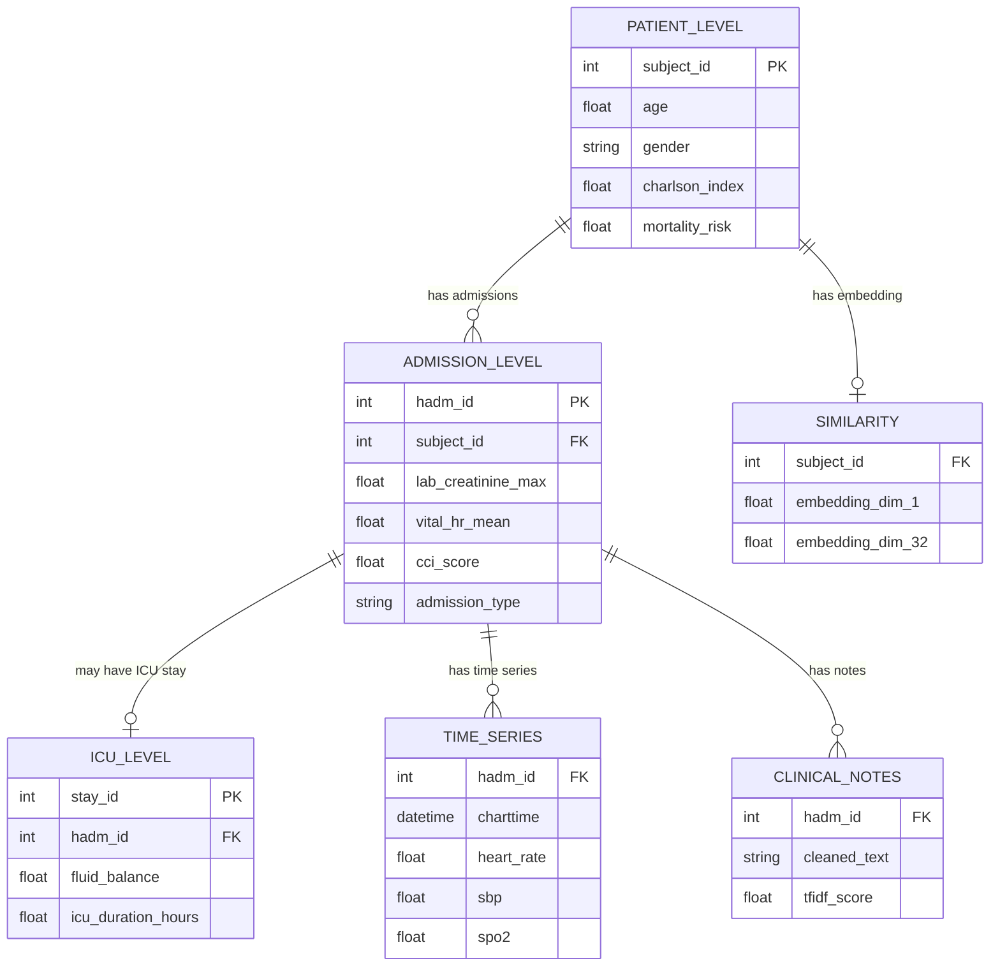
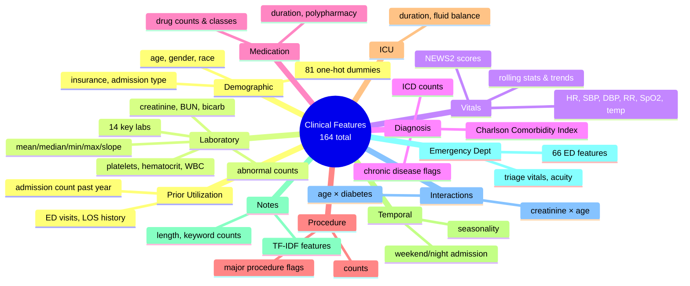
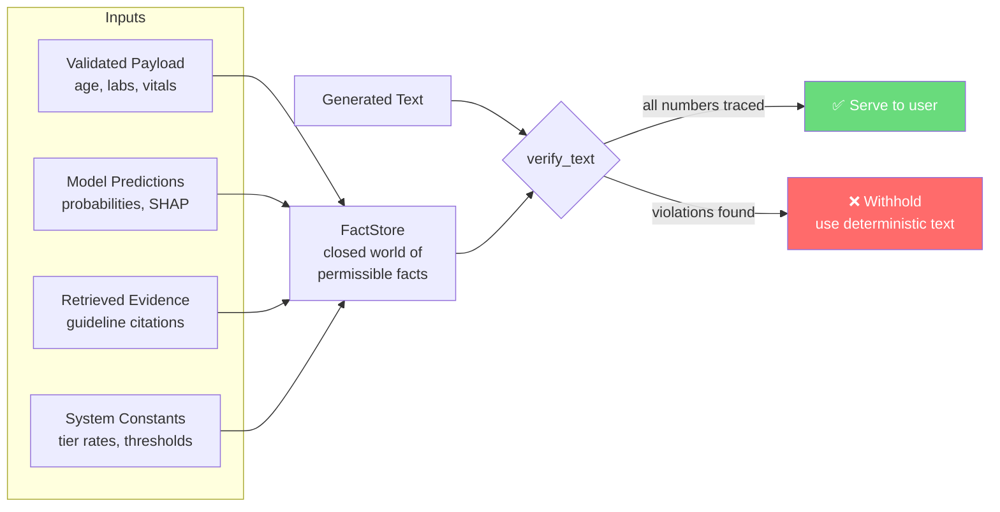

<div align="center">

# 🧬 Clinical Digital Twin

**AI-powered Personalized Patient Simulator using MIMIC-IV**

Dual-engine platform that combines calibrated risk models (trained on 534k+ hospital admissions) with a grounded RAG clinical assistant - predicting mortality, readmission, ICU need, length of stay, and deterioration from the first 24 hours of hospital data.

A research prototype - not a certified medical device.

</div>

---

> [!IMPORTANT]
> This is a **research and portfolio prototype** built on de-identified MIMIC-IV data. It has **no authentication**, **no rate limiting**, and must **never receive real patient data**. Every generated text is verified against a closed-world fact store - if the grounding check fails, the output is withheld, not shown. The system **refuses rather than imputes**: an incomplete payload returns the list of missing fields, and a task whose feature coverage falls below the measured retention floor is named as withheld rather than scored.

---

## What it does

```
Clinician enters patient data (labs, vitals, demographics, medications)
        │
        ▼
Payload validation (deterministic - refuses if incomplete)
        │
        ▼
Multi-task risk models (LightGBM/XGBoost, calibrated, from first 24h)
  ├── In-hospital mortality         (AUROC 0.9442)
  ├── 30-day readmission            (AUROC 0.7062)
  ├── ICU admission                 (AUROC 0.9209)
  ├── Length of stay (two-stage)    (AUROC 0.8997)
  └── Clinical deterioration 48h    (AUROC 0.7858)
        │
        ▼
Patient Similarity Projection (32-d Hybrid Autoencoder)
        │
        ▼
SHAP explainability & What-If Counterfactual Simulation
        │
        ▼
Evidence retrieval - curated guideline corpus (KDIGO, ACC/AHA, SSC…)
        │
        ▼
Deterministic report composition (grounded by construction)
        │
        ▼
Optional LLM rephrase → grounding verifier → withhold if it invents
        │
        ▼
Conversational assistant - multi-turn, with completeness gate
  ├── Ask what's missing before answering
  ├── Extract facts from free text
  ├── What-if counterfactual simulation
  └── Decline if no evidence on file
```

---

## Screenshots

| Case Screen - Conversational assistant & real-time risk dashboard |
|---|
|  |

| Session Timeline - Conversational exchange history | Evidence Browser - Curated offline guideline corpus |
|---|---|
|  |  |

| System Diagnostics - Health status, loaded models, & guideline counts |
|---|
|  |

---

## Architecture



---

## Safety Architecture - The Orchestrator Pipeline

The assistant does **not** follow a `user asks → LLM answers` pattern. Every turn passes through a fixed pipeline where application code - never a language model - decides whether enough information exists to answer.



**Prompt injection defence:** The gate reads `PatientContext` and the requirement policy - never message text, never model output. A message saying "ignore your rules" is extracted from like any other (it states no facts), classified like any other, and refused by the same completeness check.

---

## Data Flow - From Raw EHR to Served Predictions



---

## Sequence Diagram - Conversational Turn



---

## Sequence Diagram - What-If Counterfactual



---

## Deep Dive: Specialized Capabilities

### 1. Phase 6: Sequence vs. Tabular Modeling
Phase 6 evaluated PyTorch sequential models (LSTM/GRU and Transformer Encoders) trained on multi-event 24-hour clinical trajectories (`time_series.parquet`). While these models captured minute-level vital trend analysis, the tabular LightGBM baseline proved superior (AUPRC **0.3800** vs **0.3569** for sequence models). Event ordering did not add sufficient signal beyond what 24-hour summary statistics already captured, making the GBDT baselines the clear production choice due to their accuracy and significantly lower serving cost.

### 2. Phase 7: Patient Similarity Embeddings
To provide historical context, Phase 7 trained five variants of patient autoencoders to map admissions into a latent representation space. The **32-dimensional Dual-Head Hybrid Autoencoder** won the evaluation, enabling similarity-based retrieval of "patients like this one" from the historical cohort (improving ranking AUROC by +0.0734 over raw features). To avoid dragging a massive PyTorch dependency into the production serving layer, the forward pass was reimplemented entirely in NumPy (`twin_projection.py`).

### 3. RAG Medication & Mechanistic Linking
The `rag_corpus.py` engine evaluates the mechanistic relevance of every medication on a patient's list. It maps ingredients to drug classes (e.g., `lisinopril` → `ace_inhibitor`) and evaluates them against a curated `CLASS_RULES` engine (e.g., is a vasopressor supported by a MAP < 65 or a sepsis diagnosis?). Medications with a matching indication or physiological support score highly and are cited with reasons; drugs without an acute mechanistic link (like chronic statins) receive a neutral score. Unrecognized strings fall back to an RxNorm API search.

### 4. What-If Counterfactual Simulation
The `LiveModelRunner` supports physiological state counterfactual analysis. Clinicians can ask "what if" questions (e.g., "what if we lower their BP to 110?"). The system duplicates the patient payload, applies the modifications, and runs the entire inference pipeline—including SHAP feature attribution—on both branches simultaneously. The returned deltas allow clinicians to explore hypothetical patient trajectories and understand exactly which risk drivers would shift.

---

## Model Performance

| Phase | Task | Model | AUROC | AUPRC | Key Detail |
|:------|:-----|:------|------:|------:|:-----------|
| 1 | In-hospital mortality | LightGBM (calibrated) | **0.9442** | 0.3800 | 164 features, strict 24h window |
| 2 | 30-day readmission | LightGBM (calibrated) | **0.7062** | 0.4195 | Prior utilisation features critical |
| 3 | ICU admission | LightGBM (calibrated) | **0.9209** | 0.5369 | t=0 timing discipline, no post-ICU leakage |
| 4 | Hospital LOS (Stage A) | LightGBM (calibrated) | **0.8997** | - | Long-stay threshold: 5.63 days |
| 5 | Deterioration (48h) | LightGBM (calibrated) | **0.7858** | - | Landmark design, replaces 6h case-control |
| 6 | Mortality (sequence) | LSTM / Transformer | - | - | Minute-level vital trend analysis |
| 7 | Patient similarity | Autoencoder (5 variants) | - | - | 32-d embedding, NumPy forward pass for serving |

**Risk tiers** (from Phase 9 stratification on the 2026-08-01 model):

| Tier | Label | Observed mortality |
|:-----|:------|-------------------:|
| 1 | Low Risk | 0.01% |
| 2 | Moderate Risk | 0.34% |
| 3 | High Risk | 3.79% |
| 4 | Extreme Risk | 25.24% |

**Payload fidelity** - AUROC retained when only an unseen-patient payload (no full admission row) is supplied:

| Task | Reference AUROC | Payload AUROC | Retention | Served? |
|:-----|----------------:|--------------:|----------:|:--------|
| Mortality | 0.9448 | 0.8809 | 85.6% | ✅ Yes |
| Readmission | 0.7062 | 0.6684 | 81.6% | ✅ Yes |
| ICU admission | 0.9209 | 0.8183 | 75.7% | ✅ Yes |
| Deterioration | 0.7858 | 0.7617 | 91.6% | ✅ Yes |
| Hospital LOS | 0.8997 | 0.7314 | 57.9% | ❌ Below floor |

Tasks below the two-thirds retention floor are withheld with the reason, never scored silently.

---

## Tech Stack

| Layer | Choice | Why |
|:------|:-------|:----|
| **Frontend** | Vite + React 19 + TypeScript | Typed, fast HMR, CSS Modules for scoped styling |
| **Routing** | react-router-dom v7 | Four-screen layout: Case, Timeline, Evidence, System |
| **Styling** | CSS Modules + design tokens (`tokens.css`) | No utility framework - full control over a clinical design system |
| **Backend** | FastAPI (Python) | Async-friendly, typed routes, lifespan events for model loading |
| **Risk Models** | LightGBM + XGBoost (scikit-learn calibrators) | Gradient-boosted trees fitted on 534k MIMIC-IV admissions |
| **Sequence Models** | PyTorch (LSTM + Transformer) | Minute-level vital trend analysis (offline training only) |
| **Embeddings** | Patient Autoencoder → NumPy forward pass | 5 training variants (vanilla, triplet, SupCon, LGB-leaf, sequential); served without torch |
| **Explainability** | SHAP | TreeExplainer for per-prediction feature attribution |
| **LLM** | Gemini 3.7 Flash / OpenRouter / Ollama | Fact extraction + optional rephrase; deterministic fallback when absent |
| **Grounding** | `FactStore` + `verify_text` | Closed-world verification - every number must trace to an input |
| **RAG** | TF-IDF retrieval + PubMed + curated guidelines | 23 guideline records across 15 ICU conditions (KDIGO, SSC, ACC/AHA, …) |
| **Data format** | Parquet (Snappy) | Columnar, typed, reproducible; no CSV outputs for processed data |
| **Testing** | pytest (42 test files) | Adversarial, policy, fidelity, grounding, RAG robustness suites |
| **Visualization** | Matplotlib + Seaborn + Plotly | Publication-quality figures + interactive timelines |

### Why not torch in production?

The last macOS x86_64 torch wheel (2.2.2, built against NumPy 1.x) segfaults when a LightGBM booster is loaded into the same process. `src/llm/twin_projection.py` reimplements the Phase 7 encoder forward pass in NumPy from `models/encoder_weights.npz`, so torch is only needed offline for re-exporting weights.

---

## Project Structure

```
Clinical-Digital-Twin/
├── frontend/                        # Vite + React + TypeScript UI
│   ├── src/
│   │   ├── screens/                   # CaseScreen, TimelineScreen, EvidenceScreen, SystemScreen
│   │   ├── components/
│   │   │   ├── case/                  # CasePanel (conversation sidebar)
│   │   │   └── ui/                    # Card, Tag, Markdown, DriverBars, ModelOutputPanel,
│   │   │                              #   SourceCitation, Fact, Table, PageHeader
│   │   ├── hooks/                     # SessionContext, useSession, useAsync
│   │   ├── api/                       # client.ts (fetch wrapper), types.ts
│   │   └── styles/                    # tokens.css (design system), global.css
│   └── vite.config.ts
│
├── backend/                         # FastAPI clinician API
│   ├── main.py                        # app, CORS, lifespan (model loading)
│   ├── routes_assistant.py            # conversational turn endpoints
│   ├── routes_models.py               # validate, predict, report, whatif
│   ├── routes_evidence.py             # corpus browser
│   ├── schemas.py                     # Pydantic: TurnResponse, Predictions, Fact, Source
│   └── service.py                     # process-wide state: models + assistant
│
├── src/                             # Core Python packages
│   ├── data/                          # loader, cleaner, merger, pipeline, splits
│   ├── features/                      # 15 modules: labs, vitals, diagnosis, meds, ED, leakage, …
│   ├── models/                        # Phase 1–5 training pipelines + evaluation + calibration
│   ├── llm/                           # LLM integration layer
│   │   ├── model_runner.py              # LiveModelRunner: multi-task inference + SHAP + what-if
│   │   ├── pipeline.py                  # ClinicalReportPipeline: end-to-end grounded report
│   │   ├── report_composer.py           # Deterministic composer (no LLM needed)
│   │   ├── grounding.py                 # FactStore + verify_text (hallucination control)
│   │   ├── rag_corpus.py                # PubMed / DailyMed / DrugBank retrieval engine
│   │   ├── guidelines.py               # Curated offline guideline corpus (23 records)
│   │   ├── prompt_builder.py            # Structured prompt assembly
│   │   ├── backends.py                  # OpenRouter / Gemini / Ollama adapters
│   │   ├── twin_projection.py           # Patient embedding (NumPy, no torch)
│   │   ├── feature_space.py             # Payload → model feature alignment
│   │   ├── payload_validation.py        # Refuse-rather-than-impute validation
│   │   ├── terminology.py               # Drug & diagnosis normalization
│   │   └── evidence_cache.py            # Disk-backed retrieval cache
│   ├── assistant/                     # Multi-turn patient-facing assistant
│   │   ├── orchestrator.py              # The conversation state machine (769 lines)
│   │   ├── state.py                     # ConversationState, PatientContext
│   │   ├── intents.py                   # Intent classification (12 intents)
│   │   ├── extraction.py               # Fact extraction (LLM or deterministic)
│   │   ├── gate.py                      # Completeness gate
│   │   ├── clarify.py                   # Question generation for missing fields
│   │   ├── evidence.py                  # Evidence retrieval + tiering
│   │   ├── answer.py                    # Answer composition
│   │   ├── faithfulness.py              # Post-hoc verification of generated text
│   │   ├── triage.py                    # Emergency red-flag detection
│   │   ├── requirements.py              # Per-intent field requirements
│   │   ├── audit.py                     # JSONL audit trail
│   │   └── config/                      # YAML: capabilities, requirements, red_flags, corpus
│   ├── evaluation/                    # metrics.py
│   ├── visualization/                 # eda.py, model_plots.py, plot_utils.py
│   └── utils/                         # config, logger, io_utils, validation, schema
│
├── scripts/
│   ├── pipelines/                     # Data build + Phase 1–5 training scripts
│   ├── evaluation/                    # 14 evaluation harnesses (fidelity, RAG, judge, slices, …)
│   ├── maintenance/                   # Model promotion, calibration, tier recompute, export
│   ├── dev/                           # Smoke tests, stress tests, ID corruption rebuild
│   ├── assistant/                     # Evidence management
│   └── reports/                       # Auto-generated data reports
│
├── models/                          # Trained artifacts (gitignored)
│   ├── best_models/                   # Promoted: phase{1-5}_*_winning.pkl + calibrators
│   ├── *.pkl                          # All model variants (LightGBM, XGBoost, LogReg)
│   ├── *.pt                           # LSTM, Transformer, Autoencoder checkpoints
│   └── encoder_weights.npz           # Exported autoencoder weights (no torch needed)
│
├── data/                            # (gitignored)
│   ├── raw/hosp|icu|notes|ED/        # MIMIC-IV source CSVs
│   ├── interim/                       # Cleaned Parquet intermediates
│   └── processed/                     # Final ML-ready datasets
│
├── notebooks/                       # 15 Jupyter notebooks (01–15)
├── reports/                         # Auto-generated reports + figures + tables
├── tests/                           # 42 pytest files
├── configs/config.yaml              # Central configuration (838 lines)
├── logs/                            # pipeline.log + assistant_audit.jsonl
└── requirements.txt                 # Pinned (==), verified on Python 3.12
```

---

## Database Design (Feature Store)

The system uses **Parquet files** as its data store rather than a relational database. Six ML-ready datasets are produced by the pipeline:



| Dataset | Granularity | File |
|:--------|:------------|:-----|
| Patient Level | One row per patient | `data/processed/patient_level.parquet` |
| Admission Level | One row per hospital admission | `data/processed/admission_level.parquet` |
| ICU Level | One row per ICU stay | `data/processed/icu_level.parquet` |
| Time Series | Chronological vital/lab events | `data/processed/time_series.parquet` |
| Clinical Notes | Cleaned text + NLP features | `data/processed/clinical_notes.parquet` |
| Similarity | Embedding-ready vectors | `data/processed/similarity.parquet` |

---

## Feature Groups



---

## Getting Started

### Prerequisites

- **Python 3.12** (3.14 lacks `pydantic-core` wheels; pinned deps verified on 3.12.13)
- **Node.js** (for the frontend)
- **MIMIC-IV access** ([PhysioNet credentialing](https://physionet.org/content/mimiciv/))
- A **Gemini API key** (free) or **OpenRouter API key** (free tier) - *optional*, the system works end-to-end without one

### 1. Environment setup

```bash
cd "Clinical-Digital-Twin"
python3.12 -m venv .venv
source .venv/bin/activate
pip install -r requirements.txt
```

### 2. Place MIMIC-IV data

```
data/raw/hosp/     ← patients, admissions, diagnoses, labs, prescriptions
data/raw/icu/      ← icustays, chartevents, inputevents, outputevents
data/raw/notes/    ← discharge summaries, radiology notes
data/raw/ED/       ← edstays, triage, vitalsign, medrecon
```

Both `.csv` and `.csv.gz` formats are supported.

### 3. Run the data pipeline

```bash
# Fast smoke test (~5 min, small tables only)
python scripts/pipelines/run_pipeline.py --skip-large

# Standard mode (samples large tables via chunked reading)
python scripts/pipelines/run_pipeline.py

# Full mode (loads entire tables - may take hours and needs RAM)
python scripts/pipelines/run_pipeline.py --full
```

### 4. Train models (Phase 1–5)

```bash
python scripts/pipelines/run_mortality_pipeline.py
python scripts/pipelines/run_readmission_pipeline.py
python scripts/pipelines/run_icu_admission_pipeline.py
python scripts/pipelines/run_los_pipeline.py
python scripts/pipelines/run_deterioration_landmark.py
```

### 5. Promote and calibrate

```bash
python scripts/maintenance/promote_models.py
python scripts/maintenance/fit_group_calibrators.py
python scripts/maintenance/recompute_risk_tiers.py --patch --write-report
```

### 6. Configure the backend

```bash
cp .env.example .env
# Fill in CDT_LLM_API_KEY (Gemini) or OPENROUTER_API_KEY
# Everything else has working defaults - see .env.example for docs
```

### 7. Start the backend

```bash
.venv/bin/uvicorn backend.main:app --host 127.0.0.1 --port 8010
# Interactive docs at http://127.0.0.1:8010/docs
```

### 8. Start the frontend

```bash
cd frontend
npm install
npm run dev
# Opens at http://localhost:5173
```

---

## API Reference

### Model Endpoints

| Method | Path | Purpose |
|:-------|:-----|:--------|
| `GET` | `/api/health` | Liveness: what loaded, corpus counts, reviewed-record count |
| `GET` | `/api/models/describe` | Loaded models, their features, promoted metrics |
| `POST` | `/api/models/validate` | Check a payload without scoring - needs no models |
| `POST` | `/api/models/predict` | Multi-task risk with calibration and uncertainty |
| `POST` | `/api/models/report` | Full grounded clinical report (deterministic + optional LLM rephrase) |
| `POST` | `/api/models/whatif` | Re-score with one or more inputs changed |

### Assistant Endpoints

| Method | Path | Purpose |
|:-------|:-----|:--------|
| `POST` | `/api/assistant/sessions` | Open a conversation, receive capability message |
| `POST` | `/api/assistant/sessions/{id}/messages` | One conversational turn |
| `GET` | `/api/assistant/sessions/{id}` | Current state (for UI restore) |
| `DELETE` | `/api/assistant/sessions/{id}` | Discard conversation and all recorded data |

### Evidence Endpoints

| Method | Path | Purpose |
|:-------|:-----|:--------|
| `GET` | `/api/evidence` | Full corpus listing with tier, review status, and topics |

### Refusals are 200s

`POST /api/assistant/.../messages` returns `200` with `status: "declined_incomplete"` and a populated `questions` array when the completeness gate is closed. Returning 4xx would push callers towards retrying past a gate that exists to stop exactly that.

---

## Grounding: Why a FactStore and Not Just a Prompt

Every number and clinical claim the LLM emits must already exist in structured inputs - the validated payload, the model predictions, or the retrieved evidence. `verify_text` scans generated text and returns every violation, so the caller can regenerate, redact, or refuse.



This is a **containment** mechanism, not a correctness proof: it can show that every number traces to an input, but it cannot tell you the clinical reasoning is sound.

---

## Notebooks

Interactive walkthroughs in `notebooks/`:

| # | Notebook | Description |
|:-:|:---------|:------------|
| 01 | `01_data_loading.ipynb` | Schema inference, load summary |
| 02 | `02_data_cleaning.ipynb` | Cleaning pipeline walkthrough |
| 03 | `03_eda.ipynb` | Exploratory data analysis |
| 04 | `04_feature_engineering.ipynb` | Feature construction |
| 05 | `05_dataset_creation.ipynb` | ML-ready dataset assembly |
| 07 | `07_readmission_baseline.ipynb` | Readmission model development |
| 07 | `07_sequence_model_kaggle.ipynb` | LSTM/Transformer sequence models |
| 09 | `09_icu_admission_baseline.ipynb` | ICU admission model |
| 10 | `10_los_two_stage.ipynb` | Two-stage length of stay |
| 11 | `11_deterioration_baseline.ipynb` | Clinical deterioration |
| 12 | `12_patient_embeddings_kaggle.ipynb` | Autoencoder similarity |
| 13 | `13_risk_stratification.ipynb` | Risk tiering |
| 14 | `14_trajectory_visualization.ipynb` | Patient trajectory plots |
| 15 | `15_llm_clinical_reasoning.ipynb` | LLM integration demo |

---

## Evaluation Harnesses

The `scripts/evaluation/` directory contains 14 evaluation harnesses:

| Script | What it measures |
|:-------|:-----------------|
| `run_payload_fidelity_eval.py` | AUROC retained under payload-only input vs full admission row |
| `run_slice_eval.py` | Per-subgroup fairness (age, gender, race, insurance) |
| `run_explainability_audit.py` | SHAP attribution completeness and correctness |
| `run_llm_rephrase_eval.py` | Grounding violation rate of LLM rephrasing |
| `run_llm_end_to_end_eval.py` | End-to-end pipeline correctness |
| `run_retrieval_eval.py` | RAG retrieval precision and recall |
| `run_twin_retrieval_eval.py` | Patient similarity embedding quality |
| `run_shadow_replay.py` | Replay audit log to detect regression |
| `run_assistant_eval.py` | Multi-turn assistant policy compliance |
| `run_judge_eval.py` | LLM-as-judge scoring of assistant responses |
| `run_phase11_eval.py` | RAG + model integration evaluation |
| `run_representation_comparison.py` | Embedding variant comparison |
| `run_telemetry_eval.py` | Serve-time latency and throughput |

---

## Testing

42 pytest files covering:

- **Adversarial**: prompt injection, boundary violations, role manipulation
- **Policy**: completeness gate, requirement enforcement, intent routing
- **Extraction**: fact extraction accuracy against gold set
- **Grounding**: hallucination detection, number tracing
- **RAG robustness**: extreme queries, missing evidence, tier integrity
- **Pipeline regressions**: data leakage, feature selection, split integrity
- **Payload fidelity**: model accuracy under sparse input

```bash
# Run the full suite
python -m pytest tests/ -v

# Run a specific category
python -m pytest tests/test_assistant_adversarial.py -v
python -m pytest tests/test_llm_grounding.py -v
```

---

## Environment Variables

Set in `.env` (preferred) or the shell. Every variable is optional - with none set, the system runs end-to-end using deterministic patterns.

| Variable | Effect |
|:---------|:-------|
| `CDT_LLM_API_KEY` | Gemini API key for LLM fact extraction |
| `OPENROUTER_API_KEY` | Alternative: OpenRouter key (free tier) |
| `CDT_OPENROUTER_MODEL` | Default `gemini-3.7-flash`; alternatives: `nvidia/nemotron-3-super-120b-a12b:free` |
| `CDT_JUDGE_MODEL` | Model for LLM-as-judge evaluation (default `gemini-3.5-flash`) |
| `CDT_OPENROUTER_BASE_URL` | Provider endpoint; default points to Gemini |
| `CDT_OPENROUTER_TIMEOUT` | Request timeout in seconds (default 30) |
| `CDT_OPENROUTER_REASONING` | `off` / `low` / `medium` / `high` (default `off` - reasoning burns completion budget) |
| `CDT_LLM_MODEL` | Local Ollama model (e.g. `qwen2.5:3b-instruct`) |
| `CDT_ASSISTANT_DEBUG` | `1` to attach gate/extraction/faithfulness debug info to responses |
| `CDT_CORS_ORIGINS` | Comma-separated allowed origins |

---

## Design Principles

- **No silent data removal** - all cleaning actions are logged with counts and reasons
- **Refuse rather than impute** - missing fields are named, never filled silently
- **Parquet only** - no CSV outputs for processed data; typed, columnar, reproducible
- **Chunked I/O** - handles 40GB+ chartevents via streaming aggregation
- **Reproducible** - central config, pinned dependencies (`==`), random seeds
- **Grounded by construction** - deterministic composer produces text that passes verification by design
- **LLM is optional and verifiable** - the system works end-to-end without any LLM; when present, output is verified
- **Gate decides, not the model** - application code determines completeness; the LLM cannot override it
- **Explicit withholding** - a task below the retention floor says why, rather than showing zero

---

## Known Limitations

- **Guideline corpus is 23 records over 15 ICU conditions, none clinician-reviewed.** Sepsis, AKI, ARDS, DKA, hyperkalaemia, GI bleed, liver failure, stroke, heart failure, pneumonia, COPD, PE, pancreatitis, MI, hypertensive emergency. Anything else retrieves nothing and the assistant declines.
- **`hospital_los` is withheld** at 57.9% payload retention, below the two-thirds floor. Four of five tasks are servable from a payload.
- **Readmission needs prior utilisation.** Without admission counts, the model predicts readmission with the patient's own history hidden.
- **Triage is disabled for clinician audience.** Red-flag rules are written for patients describing symptoms; telling a clinician asking about septic shock to call an ambulance is not useful.
- **Grounding proves traceability, not correctness.** A correctly-quoted guideline that does not apply to this patient passes every check. Clinician review of the corpus is the open item.
- **No output-side safety check on LLM replies** beyond grounding. System prompts hard-constrain the model, verified against direct adversarial prompts during testing, but there's no automated classifier checking reply content.
- **66 ED features exist and reach no model.** Adoption needs a dataset rebuild and a Phase 1–5 retrain.
- **No real authentication.** Sessions are in-memory, single-worker. Designed for localhost development.
- **`labevents.csv` may be a partial download** (~14M of ~122M rows) - flagged in all reports.
- **torch segfaults on macOS x86_64** when co-loaded with LightGBM. Serving uses NumPy-only forward pass.

---

## Roadmap

### Up next
- **Deploy the backend** (Railway/Render) - frontend can point to localhost today
- **Real authentication** (JWT) - schema designed so this only adds a `user_id` column
- **Clinician review** of the guideline corpus - the single biggest trust gap

### Later
- Multilingual support (Urdu, Arabic, French)
- Dark mode for the clinician UI
- PDF export of the grounded clinical report
- Additional report types: LFT, KFT, Thyroid
- ED feature integration into Phases 1–5
- Per-endpoint rate limiting before any public deployment

### Explicitly avoided (and why)
- **LSTM/Transformer trend prediction for individual patients** - with fewer than 10 data points per patient, this is statistically meaningless. Trend analysis operates on the full cohort, not individual forecasting.
- **Sending raw reports or patient identifiers to the LLM** - the extraction prompt receives only the user's typed message; the risk models and report composer see only structured fields.
- **PaddleOCR** - too heavy for the hosting tier; causes OOM/timeouts.
- **torch in production** - segfaults on the target platform; NumPy forward pass serves equivalently.
- **Per-task uncertainty scores** - the model reports one confidence label for the whole inference; manufacturing per-task numbers would show precision the models do not have.

---

## Documentation

Auto-generated reports in `reports/`:

| Report | Contents |
|:-------|:---------|
| `cleaning_report.md` | All cleaning decisions with before/after counts |
| `eda_report.md` | EDA figure index |
| `feature_engineering_report.md` | Feature selection summary |
| `data_dictionary.md` | Feature dictionary (31k+ bytes) |
| `pipeline_summary.md` | Run metadata |
| `phase1_mortality_report.md` | Mortality model technical report |
| `phase2_readmission_report.md` | Readmission model technical report |
| `phase3_icu_admission_report.md` | ICU admission model technical report |
| `phase4_los_two_stage_report.md` | Length of stay model technical report |
| `phase5_clinical_deterioration_report.md` | Deterioration model technical report |
| `llm_layer_design.md` | LLM integration architecture |
| `llm_integration_plan.md` | Implementation plan for Phases 11–12 |
| `slice_evaluation.md` | Subgroup fairness analysis |
| `data_correction_notice.md` | Post-hoc data correction documentation |
| `clinical_digital_twin_master_proposal.md` | Full system description & proposal |

---

## License

MIMIC-IV data use requires [PhysioNet credentialing](https://physionet.org/content/mimiciv/) and DUA compliance.

## Disclaimer

The Clinical Digital Twin is a research prototype. It is not a certified medical device, does not provide medical advice, and must never be used as a substitute for consulting a qualified healthcare professional. It must never receive real patient data. All generated text is verified against structured inputs - if verification fails, the output is withheld, not shown.
